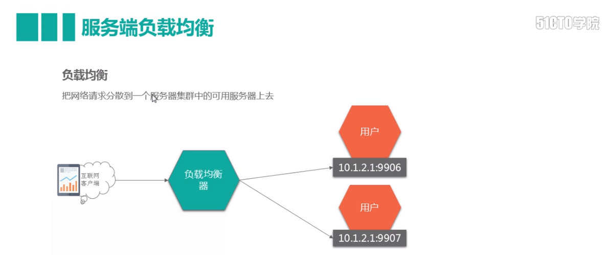
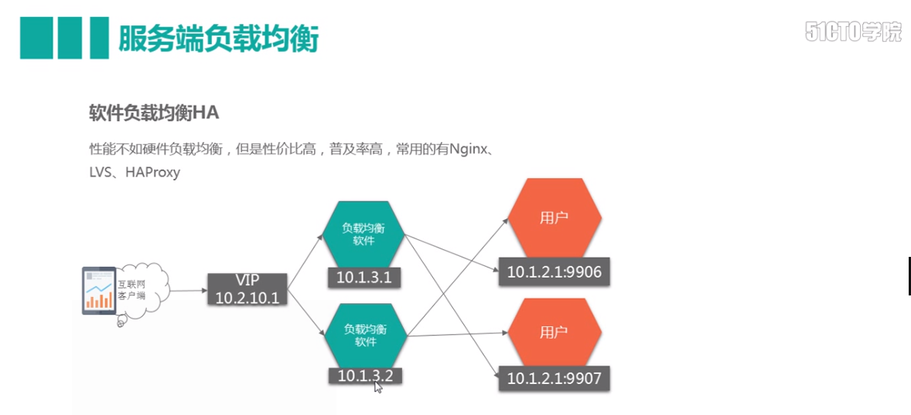

# Ribbon负载均衡
## 服务间常用调用方式
### RPC
* 远程过程调用，像调用本地服务(方法)一样调用服务器的服务
* 支持同步、异步调用
* 客户端和服务器之间建立TCP连接，可以一次建立一个，也可以多个调用复用一次链接
* RPC数据包很小
* RPC要处理的问题: 编解码，序列化，链接，丢包，协议
* 常用二进制协议:protobuf,thrift
### Rest(http)
* 支持多种协议和功能
* 开发方便成本低
* http数据包很大
## 负载均衡介绍
负载均衡分为服务端负载均衡和客户端负载均衡
### 服务端负载均衡
服务端负载均衡又分为硬件负载均衡和软件负载均衡
#### 硬件负载均衡

* 通过负载均衡硬件设备选择可用的peer节点
* 性能极其优异,成本昂贵
* 常用设备F5　　
#### 软件负载均衡

* 负载均衡软件通过选定的策略选择可用的peer节点
* 性能尚可,成本便宜
* 常用软件Nginx,LVS等
### 客户端负载均衡
客户端软件维护服务端所有peer节点,根据指定策略选择可用的peer节点
## Ribbon负载均衡实现方式
1. 从注册中心根据spring.application.name获取其下所有集群节点实例
2. 根据默认或指定的策略(如轮询,随机等)选择一个节点实例
3. 取得节点实例信息,访问该服务实例
## 具体实现
### @LoadBalanced
```
@Bean
@LoadBalanced
public RestTemplate restTemplate() {
    return new RestTemplate();
}
```
```
 restTemplate.getForObject("http://product-service/product/findById/{1}",ProductDO.class,
                productId);
```                
加上了@LoadBalanced注解后,RestTemplate实例实际会通过LoadBalancerClient以负载均衡方式调用服务
### 直接使用LoadBalancerClient
相当于以自己的代码实现@LoadBalanced注解
```
 ServiceInstance serviceInstance = loadBalancerClient.choose("product-service");
String url = String.format("http://%s:%s/product/findById/{1}",serviceInstance.getHost(),serviceInstance
        .getPort());
RestTemplate template = new RestTemplate();
ProductDO productDO = template.getForObject(url, ProductDO.class, productId);
```
## 自定义负载均衡策略
因为是消费端的负载均衡,在消费端中配置.如果要配置应用名为*product-service*的服务的负载均衡策略为随机策略
```
product-service:
  ribbon:
    NFLoadBalancerRuleClassName: com.netflix.loadbalancer.RandomRule
```    
### 策略选择
1. 如果每个机器配置一样，则建议不修改策略 (推荐) 默认策略为轮询
2. 如果部分机器配置强，则可以改为 WeightedResponseTimeRule 权重
## Ribbon编程方式自定义配置
在Ribbon启动器中RibbonClientConfiguration类,其中的各种方法提供了所有Ribbon客户端的默认配置.如:
```
@Bean
@ConditionalOnMissingBean
public IRule ribbonRule(IClientConfig config) {
    if (this.propertiesFactory.isSet(IRule.class, name)) {
        return this.propertiesFactory.get(IRule.class, config, name);
    }
    ZoneAvoidanceRule rule = new ZoneAvoidanceRule();
    rule.initWithNiwsConfig(config);
    return rule;
}
```
该方法提供了调用服务时使用的负载均衡的策略.  
可以自定义配置类,用同名方法替代的方式实现自定义配置. 如:
```
@Configuration
public class CustomizedRibbon {

    @Bean
    public IRule ribbonRule(IClientConfig config) {
        RandomRule rule = new RandomRule();
        return rule;
    }
}
```
在启动类中以注解方式启用该配置类:
```
@SpringBootApplication
@RibbonClients(defaultConfiguration = RibbonClientConfiguration.class,value = {@RibbonClient(name="product-service",
        configuration = CustomizedRibbon.class)})
public class OrderServiceApplication {
```
* @RibbonClient 可以单独使用,但一般消费方会面对多个服务提供方,@RibbonClient只能对一个提供方进行配置,所以通常使用的都是@RibbonClients
* defaultConfiguration = RibbonClientConfiguration.class 指定默认配置类
* @RibbonClient(name="product-service",configuration = CustomizedRibbon.class) 针对服务product-service使用CustomizedRibbon配置类,
其中的配置方法会优先于默认配置类中的配置方法被调用.product-service为服务应用名(spring.application.name)
* **自定义类一般不能被spring扫描到,即不能存在于启动类的同级或下级目录中,也不能在ComponentScan注解范围中,否则对所有服务都会使用该配置类,@RibbonClients中的指定都会失效**
